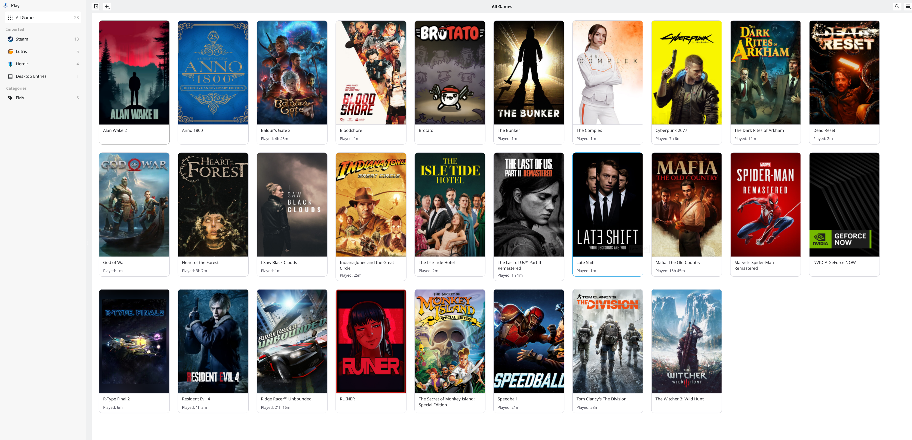
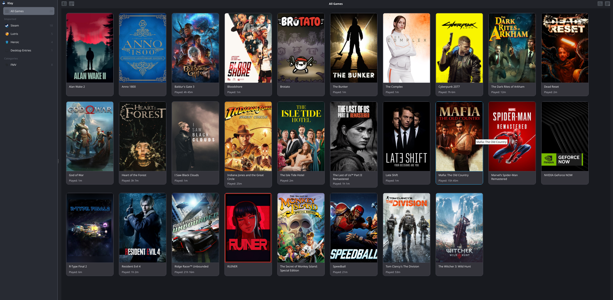
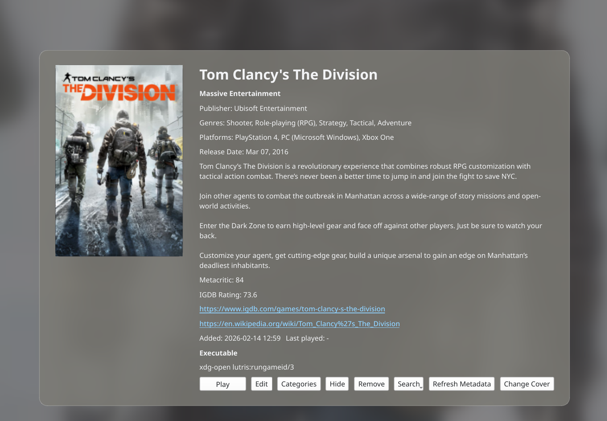
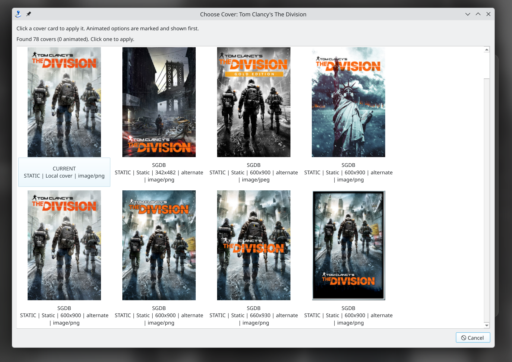

# Klay - Play your games on KDE

I built Klay because I love Linux and I am also a huge gaming nerd. I recently switched to Bazzite (based on Fedora, btw.), and my game library was scattered across too many places.

Some were in Steam. Some were cloud-only in GeForce NOW (thank you anti-cheat), and some were from Heroic, Lutris, Bottles, itch, or random desktop launchers. I wanted one launcher that felt native on KDE and gave me one clean library to manage. I was tired of the different ways to launch games. I used Cartridges for a long time, but I felt the time was right to go in a different direction. Something that suited me, and something I am proud to share in case it helps others as well. 

This repo is **not 100% human coded** - Raise the RED FLAGS and SOUND THE ALARMS, if you care. Of course I am going to use AI to help me code! My day job is Sr. Director of Generative AI at Red Hat, after all. If you do care, please open an issue so we can discuss this - human to human. If you don't - This application will work (carefully guided by my own hands, someone who loves linux and loves gaming - I am currently playing Cronos, about time?). 

I use this application/code daily because it solves a real need / want for me. I will continue to evolve it based upon feedback and things that I would use daily as a bazzite gamer! 

**Are you looking for a great game launcher and manager for Linux?**

Klay is that project.

It is heavily inspired by [Cartridges](https://github.com/kra-mo/cartridges) for GNOME, but built around a Qt/KDE workflow.

## Why I Built Klay

- I wanted one place for all my games on Linux.
- I wanted it to feel right on KDE, not like a GTK app bolted on.
- I wanted better control over covers, metadata, categories, and launch behavior.
- I wanted GeForce NOW support that works with how Linux users actually run it (Flatpak + cache data).

## Who Klay Is For

Klay is for you if:

- You game on Linux (especially KDE/Bazzite) and use more than one launcher.
- You are tired of hunting through Steam, Heroic, Lutris, and desktop entries just to find what to play.
- You care about organizing your library (covers, categories, metadata) instead of just launching binaries.
- You want a local-first launcher that still supports online metadata when you opt in.

Klay is probably not for you if you only use a single launcher and never want to customize your library.

## What It Does

- Qt desktop app (`PySide6`) tuned for KDE workflows
- Imports from:
  - Steam
  - GeForce NOW
  - Lutris
  - Heroic
  - Bottles
  - itch
  - Legendary
  - RetroArch
  - Flatpak
  - Desktop Entries
- Main library cover grid with animated cover support (`.gif`, animated `.webp`)
- Game details page with metadata and quick actions
- SteamGridDB + IGDB integration for covers and metadata (you provide your own API keys)
- Playtime on game cards when source data is available
- Category management (create, rename, delete, assign, custom icons)
- Optional splash screen + startup sound

## Screenshots

<p align="center">
  
  
</p>

<p align="center">
  
  
</p>

## Download (Flatpak)

Latest releases:

`https://github.com/gshipley/Klay/releases/latest`

Install from a downloaded release asset:

```bash
flatpak install --user --reinstall ./com.grantshipley.Klay.Devel.flatpak
flatpak run com.grantshipley.Klay.Devel
```

## Build From Source

```bash
meson setup _build
meson compile -C _build
```

Run:

```bash
./_build/klay/klay
```

## Runtime Dependencies

- Python 3
- PySide6 (Qt frontend)
- PyGObject (`gi`, GLib/Gio bindings used by import backends/settings)

Fedora:

```bash
sudo dnf install python3-pyside6 python3-gobject
```

Pip (user install):

```bash
python3 -m pip install --user PySide6
```

Optional:

- `ffprobe` for accurate splash sound duration detection

## CLI Options

- `klay --search "term"`: open with a pre-filled search term
- `klay --launch GAME_ID`: launch a game directly by id

## Using Klay

### Import games

- Use `Import` from the main UI.
- Enable/disable sources in `Preferences -> Sources`.
- Configure source paths if your launchers are in non-default locations.
- You can trigger an on-demand import from `Preferences -> Import -> Import Games Now`.

GeForce NOW notes:

- Requires NVIDIA GeForce NOW Flatpak (`com.nvidia.geforcenow`) installed.
- Imports linked GeForce NOW library entries from local GeForce NOW cache:
  - `.../CefCache/Default/Service Worker/CacheStorage`
- Supports entries across linked stores when present in your GFN library:
  - Steam
  - Xbox / Game Pass
  - Epic
  - Ubisoft Connect
  - EA App
- Uses the GeForce NOW catalog API to resolve launch-route metadata (`cmsId`, variant routing, parent game id).
- Installed Steam titles are still considered.
- Steam games you own but do not have installed are read from local Steam data (`userdata/*/config/localconfig.vdf`) when available.
- Public Steam profile lookup is only a fallback when local Steam ownership data is unavailable and GFN library cache data is unavailable.
- By default, GeForce NOW entries appear under the `GeForce NOW` source filter and are not included in `All Games`.

`Preferences -> GeForce NOW` includes:

- `Include GeForce NOW games in All Games`
- `Close GeForce NOW after stream ends (best effort)`

### Browse and filter

- Left nav shows:
  - `All Games`
  - `Added`
  - source groups
  - custom categories (if assigned)
- Search filters by title, metadata fields, and categories.
- Sort modes include A-Z, Z-A, newest, oldest, and last played.

### Game details

From details view you can:

- Play
- Edit
- Hide / Unhide
- Remove
- Search external databases
- Refresh metadata
- Change cover
- Manage categories

Click outside the details card to return to the main library.

### Covers and animation

- Supports static and animated covers.
- Cover picker shows candidates in card form and marks animated options.
- Animated covers are prioritized when enabled.
- Custom chosen covers are preserved and not overwritten by startup auto-import.

### Metadata providers

`Preferences -> SteamGridDB`:

- Add SGDB API key
- Enable cover lookup
- Prefer SGDB covers
- Allow animated SGDB covers
- Optionally include image updates during metadata refresh

`Preferences -> IGDB`:

- Provide `Client ID` and either:
  - `Access Token`
  - `Client Secret` (Klay can fetch token automatically)
- Enable IGDB metadata enrichment
- Refresh metadata on demand

## Categories

- Assign categories per game from details view (`Categories`) or right-click menu (`Categories...`).
- Manage definitions in `Preferences -> Categories`:
  - Add
  - Rename
  - Delete (with confirmation)
- Customize category icons in `Preferences -> Categories`:
  - Pick from built-in icon set
  - Upload your own icon
  - Clear custom icon and fall back to default

Category filters show up in the left nav only when games are assigned to that category.

## Preferences

General settings include:

- Dark mode
- Splash screen + startup sound
- Auto import on startup
- Exit after launch
- Cover click launches game vs opens details
- High-quality image preference
- Remove missing imported games

GeForce NOW settings include:

- Include GeForce NOW games in `All Games`
- Optional auto-close of GeForce NOW when a stream ends (best effort)

## Data Paths

Klay uses its own namespace:

- Config: `~/.config/klay/`
- Data: `~/.local/share/klay/`
- Games JSON: `~/.local/share/klay/games/`
- Covers: `~/.local/share/klay/covers/`

## Troubleshooting

### IGDB metadata not loading

- Verify `Client ID` is set.
- Provide either a valid `Access Token` or `Client Secret`.
- If using secret-only mode, ensure outbound access to Twitch token endpoint is allowed.

### Cover picker appears slow

- First open may fetch and cache provider results.
- Subsequent opens use local cache and should be faster.

### A launcher game is missing

- Confirm source is enabled in Preferences.
- Verify source path values.
- Re-run import and check status output in the import dialog.

### GeForce NOW game is missing

- Confirm `GeForce NOW` source is enabled in `Preferences -> Sources`.
- Confirm `com.nvidia.geforcenow` Flatpak is installed.
- Launch GeForce NOW once and open `Library` so local cache data is populated.
- For non-Steam titles, make sure the platform account is connected in GeForce NOW and the game appears in your GFN `Library`.
- Ensure Steam has logged in at least once on this machine so local ownership data exists under `userdata/*/config/localconfig.vdf`.
- If local ownership data is missing, Klay falls back to Steam profile lookup.

### GeForce NOW auto-close not working

- Enable in `Preferences -> GeForce NOW -> Close GeForce NOW after stream ends`.
- This is best-effort behavior based on runtime/log signals and can vary between GFN client versions.

## Project Notes

- App ID: `com.grantshipley.Klay`
- Binary: `klay`
- Python namespace: `klay`
- Extension docs: `docs/klay.md`
